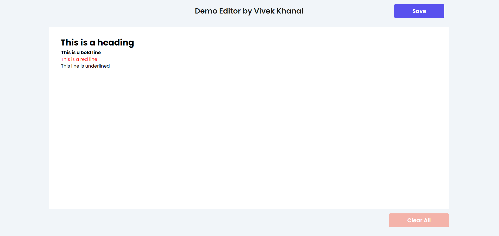

# DRAFT JS FIRST TRY

This is a text editor developed by using Draft.js and React Js. It has markdown type formatting options.

## [Demo Link](https://draftjs-tryout.vercel.app/) 🔗

<div align="center">
  
  <br>
</div>

## Features

- _Responsive screen_ 💻📱
- _Clear button clears all the content from the editor and localStorage_ 🚮
- *Save button saves the content, format and last cursor position in localStorage*⚡
- *Typing '#' as the first string in a line & pressing space makes anything you type afterwards on the same line be in a “Heading” format. On pressing space the aforementioned '#' disappears*💯
- _Similarly, typing '_' as the first string in a line and pressing space corresponds to “bold” format\*🥳
- *Typing '\*\*' as the first string in a line and pressing space corresponds to red color text format*🤘
- \*Typing '*\*\*' as the first string in a line and pressing space corresponds to underline text format*🙌

## Technologies used 🛠️

- **React JS** 🚀
- **Draft JS** 🚀
- **Vercel** 🚀
- **JSX** 🚀
- **CSS** 🚀

---

## How To Install In Your PC 🔧

From your command line, first clone this repo:

```bash

# Clone this repository
$ git clone https://github.com/dev-vivekkhanal/draftjs_tryout.git

# Go into the repository
$ cd draftjs_tryout


```

Then you can install the dependencies

Using NPM:

```bash

# Installing dependencies
$ npm install

```

Now you can run the react app

Using Vite:

```bash

# Running react app
$ npm run dev

```

## Developed by 👨‍💻

- **Vivek Khanal** - **[Linkedin](https://www.linkedin.com/in/vivek-khanal/)**, **[Github](https://github.com/dev-vivekkhanal)**, **[Portfolio](https://portfolio-v1-nextjs.vercel.app/)**
